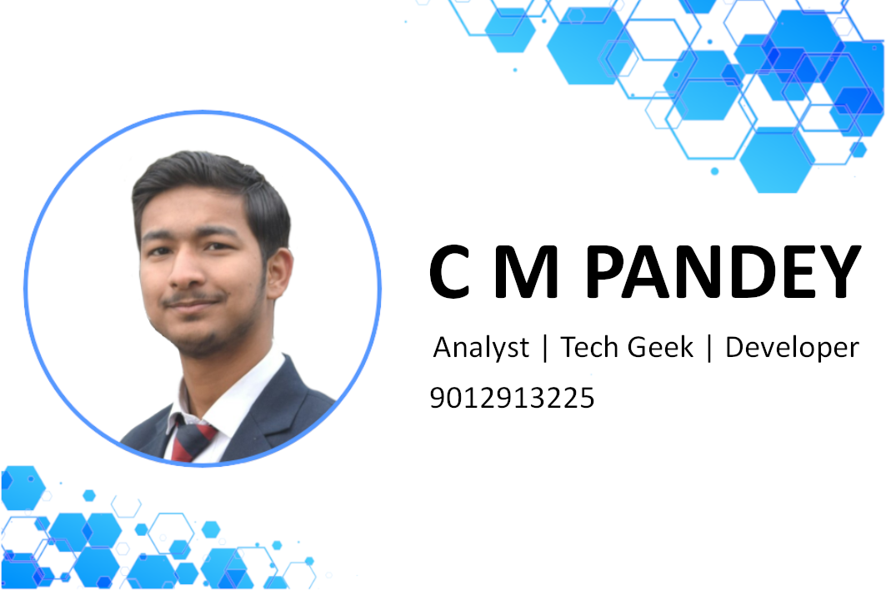

  

## PROFILE

A professional in the field of IT since the date of birth, who has a great affinity towards everything that's technical; fueled with lots of optimism and self-motivation. Wrote a piece of code 5 years ago, it was fun; so that's what I have been doing till date.

## EDUCATION

**Amrapali Group of Institutes (2017 - 2020)**
- Class Representative
- Pursuing Bachelor of Computer Applications
- Won KDMM 2018 (Inter-College Quiz Competition)
- Ist Runner Up in Sandhaan Codex 2019 (Inter-College Competitive Coding Competition)

**Doon Public School (2008 - 2016)**

- Secured first division in High School (X) & Senior Secondary (XII)

## SKILLS

**Languages known**
- C
- C++
- C#
- Java
- HTML
- CSS
- JS
- SQL

**Soft skills**
- Optimism
- Leadership
- Analytical Skill
- Public Speaking
- Commercial Awareness

## CERTIFICATIONS

- Programming in C
- Android Apps Development
- Advanced Office Automation
- Internet of Things with Python
- National Youth Parliament Festival
- Cloud Computing & the Virtual World
- Object Oriented Programming using C++
- Building Awareness on Intellectual Property Rights

## CONTACT

➡️   9012913225

➡️   chandramohan.pandey2015@gmail.com

➡️   instagram.com/cmcodes

➡️   linkedin.com/in/cmpandey

➡️   github.com/Cm-Champ
